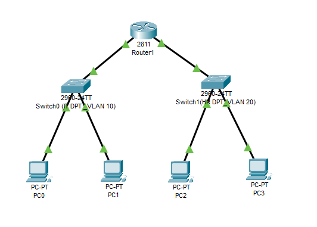

# Small Office VLAN + DHCP Lab

Hands-on Cisco Packet Tracer lab simulating a small office network with VLANs, DHCP, and inter-VLAN routing.

---

## 🗺️ Network Topology


---

## 🧠 Project Overview
This lab simulates a **small office network** using Cisco Packet Tracer.  
It demonstrates how to separate departments using **VLANs**, configure **DHCP** on a Cisco router, and enable **inter-VLAN routing** for communication between networks.

✅ **Skills Demonstrated**
- VLAN creation and switch port management (Layer 2)
- Router configuration for multiple subnets (Layer 3)
- DHCP address assignment and troubleshooting
- Inter-VLAN routing and connectivity testing
- Network documentation and verification commands

🧩 **Tools Used**
- Cisco Packet Tracer
- Cisco 2811 Router & 2960 Switches
- Windows PCs for testing and verification

---

## 🧾 IP Addressing Scheme
| VLAN | Department | Subnet | Default Gateway | DHCP Range |
|------|-------------|---------|-----------------|-------------|
| 10 | IT | 192.168.10.0/24 | 192.168.10.1 | 192.168.10.10–192.168.10.50 |
| 20 | HR | 192.168.20.0/24 | 192.168.20.1 | 192.168.20.10–192.168.20.50 |

---

## ⚙️ Router Configuration (Key Commands)

```bash
interface fa0/0
 ip address 192.168.10.1 255.255.255.0
 no shutdown
!
interface fa0/1
 ip address 192.168.20.1 255.255.255.0
 no shutdown
!
ip dhcp excluded-address 192.168.10.1 192.168.10.9
ip dhcp excluded-address 192.168.20.1 192.168.20.9
!
ip dhcp pool VLAN10
 network 192.168.10.0 255.255.255.0
 default-router 192.168.10.1
 dns-server 8.8.8.8
!
ip dhcp pool VLAN20
 network 192.168.20.0 255.255.255.0
 default-router 192.168.20.1
 dns-server 8.8.8.8

vlan 10
 name IT
interface range fa0/2-3
 switchport mode access
 switchport access vlan 10
interface fa0/1
 switchport mode access
 switchport access vlan 10

vlan 20
 name HR
interface range fa0/2-3
 switchport mode access
 switchport access vlan 20
interface fa0/1
 switchport mode access
 switchport access vlan 20 ```.


🧪 Connectivity Test

All PCs successfully obtained IP addresses via DHCP and communicated across VLANs.

✅ VLAN 10 PC0: 192.168.10.11 → Gateway 192.168.10.1 → Success
✅ VLAN 20 PC2: 192.168.20.10 → Gateway 192.168.20.1 → Success
✅ Inter-VLAN ping: Success after ARP resolution (0% packet loss)

## 👋 About Me
I'm an aspiring **System Administartor** and **Network Security Engineer** with a strong interest in practical, hands-on learning.  
I enjoy building and troubleshooting real network environments using tools like **Cisco Packet Tracer**, **Kali Linux**, and **VirtualBox**.  

Currently, I’m developing my technical foundation through certifications such as **CompTIA Security+**, **Network+**, and **Cisco CCST**, while creating personal labs to strengthen my understanding of **network infrastructure** and **cyber defense fundamentals**.  

Each project I post on GitHub represents a step toward mastering **real-world IT and cybersecurity skills** — from networking basics and scripting to ethical hacking and system hardening.
